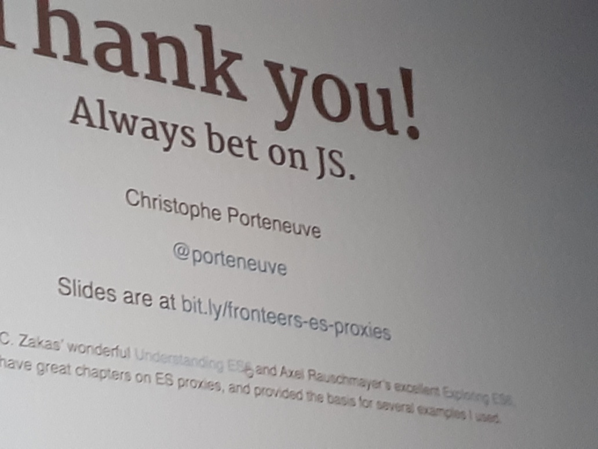

## Porteneuve - ES proxies

- Porteneuve organises [Dot.js](https://www.dotjs.io/), Paris, December
- Reflect API - Low level JS API similar to proxies
- [Proxies](https://developer.mozilla.org/en-US/docs/Web/JavaScript/Reference/Global_Objects/Proxy)
- Note to self: can proxies be used to correct the min/max filters?
- Again somebody is super enthusiastic about [Immer](https://immerjs.github.io/). There's an [Egghead course](https://egghead.io/lessons/redux-simplify-creating-immutable-data-trees-with-immer) as well.

## Joubran - App like PWA's

To mimic an app:

- Create an app shell
- Keep first load under 40kB
- Make use of [Workbox](https://developers.google.com/web/tools/workbox)
- Use code splitting
- Use `script type=module` to [handle external JavaScript as modules](https://jakearchibald.com/2017/es-modules-in-browsers/)
- [Scroll snap](https://css-tricks.com/practical-css-scroll-snapping/)
- Show "Still loading" for chunks loading longer than 3s
- Defer non-critical content with `requestIdleCallback()`
- Amazing talk, slides at [jadjoubran.io/fronteers19](https://jadjoubran.io/fronteers19)

## Rest

- `animation-delay=-2s` can have a _negative_ value so the animation looks like it has started in the past already
- An input can be `:valid` and `:invalid`
- [React vs web components](https://www.youtube.com/watch?v=plt-iH_47GE) by Paul Lewis
- Custom elements (web components) do not always play well together with the modern JS libraries: [custom-elements-everywhere.com](https://custom-elements-everywhere.com/)
